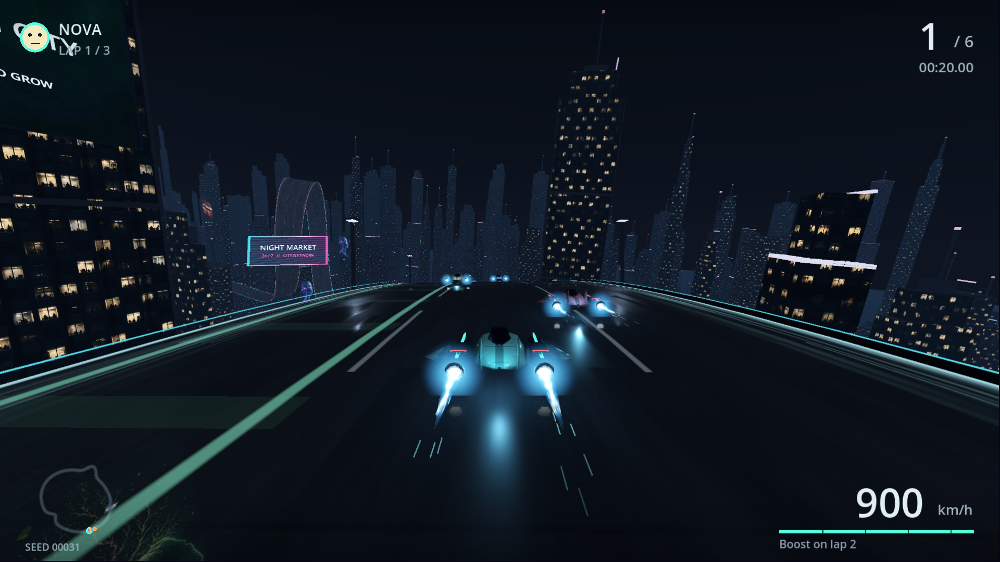
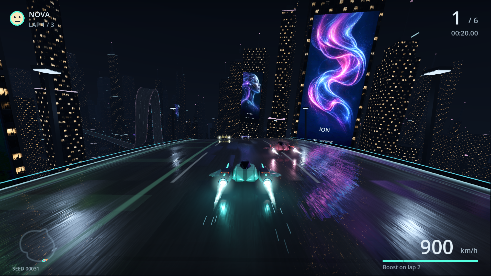

# Lighting review — 25 September 2026

The fixed gameplay scene now has separate colored engine highlights, readable
warm office windows, varied tower silhouettes, mounted artwork and rippled
reflections of both windows and advertisements. Floating text boards were removed.
This remains a stylized game: the reference has substantially richer vehicle
models, architecture, physically complete reflections and fine material detail.

## Same-camera comparison

Seed 00031, circuit fraction 0.055, six racers, normal chase camera, 1920×1080.
These are native game screenshots, with no compositing or image enhancement.

Before:

After:

## Method and results

Godot 4.5.2 Forward+, RTX 5070 Ti (driver 610.74), Ryzen 9 5900X.
High renders 1920×1080 total; four views are 960×540 each. Both use 2× MSAA.
Every run warmed for five seconds, then sampled 1,800 uncapped frames with VSync
disabled. Three independent runs per view count, alternating solo and split-screen.
GPU times sum the root and player viewport timestamp measurements. Rendering CPU
time adds viewport measurements and frame setup; it excludes gameplay scripts.
Wall intervals include engine, harness and background scheduling overhead.
Screenshot readback and file writes occur after sampling.

| Views | Before GPU mean (ms) | After GPU mean (ms) | After GPU p95 range (ms) | Draw calls | Video memory (MiB) |
|---|---:|---:|---:|---:|---:|
| 1 | 0.827 | 1.154 | 1.303–1.330 | 425 → 408 | 694 → 710 |
| 4 | 1.298 | 1.911 | 2.036–2.290 | 1501 → 1415 | 731 → 781 |

GPU means are the median of three run means, not gameplay frame rates. Baseline
is commit 596cbb6 with the same harness/camera; CPU contention was not logged at
baseline. Final telemetry records GetSystemTimes CPU utilization and nvidia-smi
utilization/clocks/power. Power plans, GPU clocks, affinity and runner services
were left unchanged. The CSV files preserve individual samples and all JSON
percentiles; GPU sums are rendering measurements, not full end-to-end latency.

## Moving four-player runs under background load

3,600 uncapped frames with bot driving, normal physics, cameras, HUD and speed blur.
The course progresses naturally, so these cover different views from the static
scene and are not identical trajectories between quality settings. Observed FPS
is 1000 divided by mean wall milliseconds. It is not a guaranteed frame rate.

| Run | Observed mean FPS | Wall p95 / p99 (ms) | GPU mean (ms) | Mean system CPU |
|---|---:|---:|---:|---:|
| moving-4 | 72.6 | 18.00 / 21.50 | 1.816 | 80.4% |
| moving-4-balanced | 83.7 | 15.79 / 18.27 | 1.027 | 76.4% |
| opt-moving-4 | 173.3 | 7.82 / 10.16 | 1.417 | 25.2% |

`moving-4` is the candidate with SSIL enabled; `opt-moving-4` is the final High
setting without SSIL. Balanced already omitted SSIL. WSL Runner.Worker,
chrome-headless and Node processes were active during testing. Their changing
CPU demand makes wall/CPU comparisons unsuitable for attributing an optimization
gain. System CPU is whole-machine utilization, not the game process's utilization.
In particular, lowering GPU cost alone cannot guarantee 60 FPS under contention.

## Effect isolation and decisions

The earlier iteration E used the same seed, pose and camera. The following
single-effect removals are compared against its 1.307 ms GPU mean. They estimate
cost at that scene, not universal costs or additive savings. The final pass then
improved nearby facade selection and moved mounted ads lower on buildings.

| Disabled effect | GPU mean (ms) | Difference from E (ms) |
|---|---:|---:|
| no-box-reflections | 1.234 | 0.073 |
| no-ssr | 1.110 | 0.197 |
| no-ssil | 1.140 | 0.167 |
| no-shadows | 1.269 | 0.038 |
| no-volumetrics | 1.228 | 0.080 |
| no-probes | 1.291 | 0.017 |

SSIL changed the mean RGB image value by only 0.014/255 in that comparison, while
costing about 0.17 ms and additional buffers. It is disabled by default. Short
volumetric haze visibly softens fixture lighting and remains High-only. Shadows
are capped at two nearby sources per player (two active solo, six in this fixed
four-player scene). Static probes are captured once per race, not every frame.
The final window-reflection selection excludes tiny roof equipment so useful
building walls receive the bounded reflection budget.

The road intersects up to 24 nearby box-shaped building parts in the opening 16%
of the course and four nearby billboard planes per chunk. Facade evaluation is
shared with the visible building shader. This is software geometry intersection,
not hardware RTX, full-scene ray tracing or full global illumination. Octagonal
towers, small details and unselected occluders are omitted. Changes in the chosen
set can appear at chunk boundaries; screen-space reflections retain their normal
off-screen limitations. Probes supplement the wider environment. The rest of the
procedural circuit uses the lighter city treatment.

## Reproduce and inspect

Validation: 17,714 city/geometry checks across eight seeds, 21 exhaust/startup
checks, 62 lighting-budget checks and the seed/controller menu test passed.
Native screenshots were inspected at the opening, loop and tunnel, in four-player
split-screen, Performance and OpenGL fallback. The Gamenight synthetic-host test
passed on both source/headless and the packaged native executable: authentication,
hidden preparation, controller ownership, pause, profiles and disposal.
Physical controller testing was not repeated in this pass. OpenGL still reports
the pre-existing two small sky-texture cleanup warnings on exit; its short capture
run is a compatibility check and is excluded from performance conclusions.

Run `tests/lighting_bench.gd` as described in the README. `--moving`, `--views=4`,
`--quality=.8` and `--landmark=loop|tunnel` cover additional cases.
`--ablation=with-ssil` restores the measured optional pass.

Raw frame CSVs, engine result JSONs and available background telemetry are in
[lighting-data](lighting-data/); [summary.json](lighting-data/summary.json) combines
run summaries and CPU measurements. Full intermediate captures and logs remain
in `C:/dev/ion-rush-captures/lighting` on the development machine.

Timing API reference: [Godot RenderingServer](https://docs.godotengine.org/en/4.5/classes/class_renderingserver.html).
