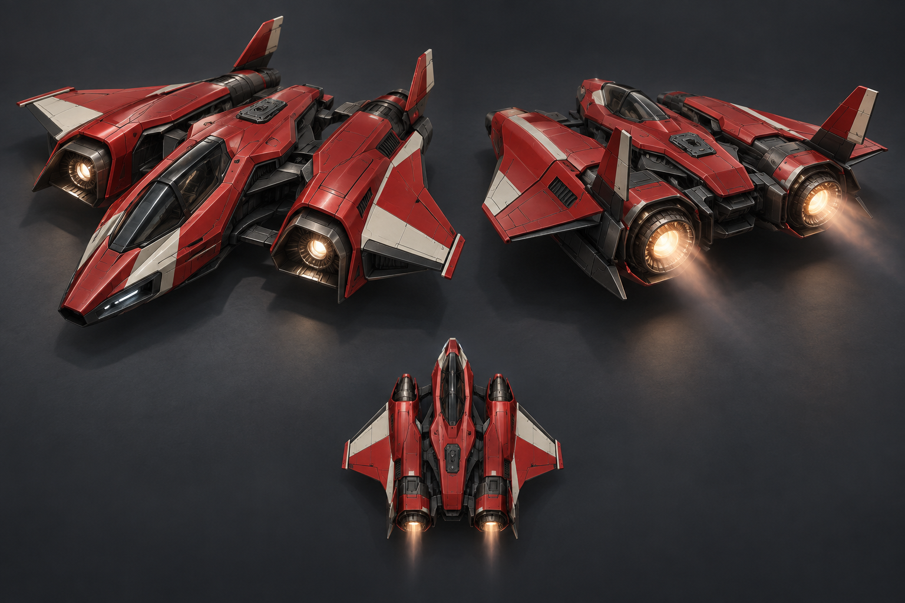
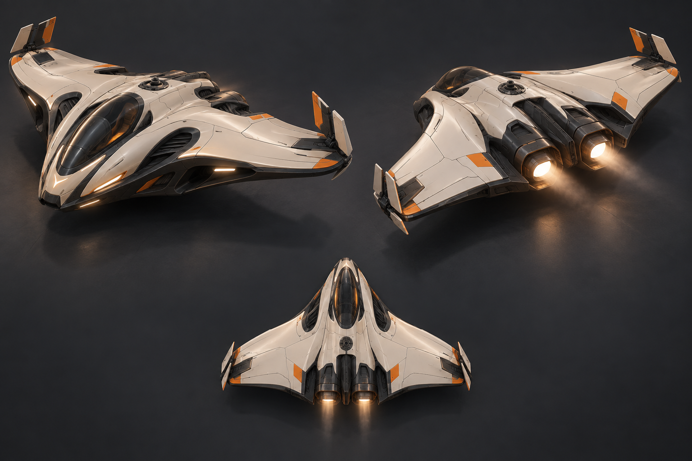
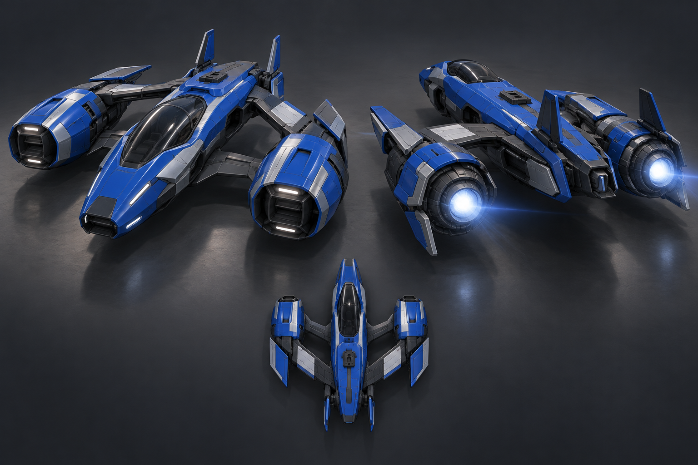

# Vehicle design exploration

Generated with the built-in ChatGPT image-generation tool. Concept images only; not implemented vehicle meshes. Three views are exploratory references, not dimensionally exact production drawings.

## 01-twin-engine

### Generation prompt

Use case: stylized-concept.
Asset type: vehicle design exploration for Ion Rush, a high-speed anti-gravity racing game in neon cities, enormous forests and microscopic biomes.
Create a polished industrial-design concept sheet, landscape format, of ONE original playable racing aircraft. Two large consistent views of exactly the same design: left a front three-quarter elevated view, right a rear three-quarter elevated chase-camera view, with a small crisp top-down silhouette beneath. All views fully in frame, generously spaced. Neutral dark slate studio backdrop, clean ground shadow, tasteful softbox lighting reveals the geometry. Premium real-time videogame visual quality: beautifully resolved low-complexity major forms, glossy painted panels over dark mechanical structure, a few brushed metal parts, smoke-glass single-pilot cockpit. It must be feasible as a performant 3D game asset; its appeal comes from silhouette, proportions and material contrast, not thousands of tiny details.
Roughly 9 meters long and 8–9 meters wide, squat and planted for hovering inches above a road, able to transition into jet-like flight. Distinct wing control surfaces and hinged tail rudders, readable mechanical seams, powerful recessed engine throats with white-hot cores and restrained bloom. Engine light softly illuminates adjacent bodywork. No wheels, no conventional car chassis, no giant military armament, no exposed pilot, no floating disconnected parts. Reserve a small clean dorsal mounting socket for interchangeable gameplay weapons. Broad side panel suitable for a player portrait decal, but leave blank. No UI, annotations, logos or text. Avoid overdesigned Gundam clutter, giant decorative spikes, gratuitous edge glow and exhaust obscuring the craft.
Design direction 01: muscular twin-engine sprint racer. Deep vermilion painted main body, graphite lower hull, small ivory racing accents. A short central chisel nose with black inset canopy, two substantial rear jet nacelles integrated into an angular broad delta wing. Real negative space between central fuselage and engine shoulders. Two small outward-canted tail fins with obvious separate rudders; broad rear wing elevons. Sculpted flowing transitions contrast with crisp aero edges. Beautifully designed rear engine framing, short faint exhaust plume so geometry remains clear. Aggressive compact purposeful silhouette, not a conventional fighter jet.

## 02-flying-wing

### Generation prompt

Use case: stylized-concept.
Asset type: vehicle design exploration for Ion Rush, a high-speed anti-gravity racing game in neon cities, enormous forests and microscopic biomes.
Create a polished industrial-design concept sheet, landscape format, of ONE original playable racing aircraft. Two large consistent views of exactly the same design: left a front three-quarter elevated view, right a rear three-quarter elevated chase-camera view, with a small crisp top-down silhouette beneath. All views fully in frame, generously spaced. Neutral dark slate studio backdrop, clean ground shadow, tasteful softbox lighting reveals the geometry. Premium real-time videogame visual quality: beautifully resolved low-complexity major forms, glossy painted panels over dark mechanical structure, a few brushed metal parts, smoke-glass single-pilot cockpit. It must be feasible as a performant 3D game asset; its appeal comes from silhouette, proportions and material contrast, not thousands of tiny details.
Roughly 9 meters long and 8–9 meters wide, squat and planted for hovering inches above a road, able to transition into jet-like flight. Distinct wing control surfaces and hinged tail rudders, readable mechanical seams, powerful recessed engine throats with white-hot cores and restrained bloom. Engine light softly illuminates adjacent bodywork. No wheels, no conventional car chassis, no giant military armament, no exposed pilot, no floating disconnected parts. Reserve a small clean dorsal mounting socket for interchangeable gameplay weapons. Broad side panel suitable for a player portrait decal, but leave blank. No UI, annotations, logos or text. Avoid overdesigned Gundam clutter, giant decorative spikes, gratuitous edge glow and exhaust obscuring the craft.
Design direction 02: elegant broad crescent flying-wing racer. Pearl ivory ceramic-like painted wing shell over black graphite underside, restrained orange identification accents. Entire silhouette is a smooth flattened boomerang with a compact central canopy; substantial thickness and purposeful aero inlets, NOT a paper-thin plane. Central twin closely spaced flattened oval engine exhausts, sculpted recessed exhaust channels. Two short deployable split rudder blades near the outer trailing edge, integrated articulated elevons. A more graceful and unmistakably different silhouette than a standard delta fighter; soft compound surfaces and a few clean panel divisions. Warm white engine glow, short faint plume. No tall vertical tails.

## 03-engine-pods

### Generation prompt

Use case: stylized-concept.
Asset type: vehicle design exploration for Ion Rush, a high-speed anti-gravity racing game in neon cities, enormous forests and microscopic biomes.
Create a polished industrial-design concept sheet, landscape format, of ONE original playable racing aircraft. Two large consistent views of exactly the same design: left a front three-quarter elevated view, right a rear three-quarter elevated chase-camera view, with a small crisp top-down silhouette beneath. All views fully in frame, generously spaced. Neutral dark slate studio backdrop, clean ground shadow, tasteful softbox lighting reveals the geometry. Premium real-time videogame visual quality: beautifully resolved low-complexity major forms, glossy painted panels over dark mechanical structure, a few brushed metal parts, smoke-glass single-pilot cockpit. It must be feasible as a performant 3D game asset; its appeal comes from silhouette, proportions and material contrast, not thousands of tiny details.
Roughly 9 meters long and 8–9 meters wide, squat and planted for hovering inches above a road, able to transition into jet-like flight. Distinct wing control surfaces and hinged tail rudders, readable mechanical seams, powerful recessed engine throats with white-hot cores and restrained bloom. Engine light softly illuminates adjacent bodywork. No wheels, no conventional car chassis, no giant military armament, no exposed pilot, no floating disconnected parts. Reserve a small clean dorsal mounting socket for interchangeable gameplay weapons. Broad side panel suitable for a player portrait decal, but leave blank. No UI, annotations, logos or text. Avoid overdesigned Gundam clutter, giant decorative spikes, gratuitous edge glow and exhaust obscuring the craft.
Design direction 03: kinetic outrigged engine-pod racer. Saturated cobalt-blue paint, graphite mechanics and restrained pale silver panels. Long narrow central fuselage with a short blunt dart nose and low canopy, two powerful distinct compact engine pods mounted forward of the rear tip on solid swept structural wing bridges. Wide open negative-space channels between pods and central fuselage. Each pod has a large recessed circular rear exhaust and compact hinged control vane. Two small upright rear tail rudders on the central hull, clear wing flaperons on bridges. Balanced wide stance, physically connected strong structure, not a fragile spacecraft. Engine pods dominate rear-view identity with bright white-blue cores and a subtle horizontal optical flare; short exhaust leaves the silhouette legible.

